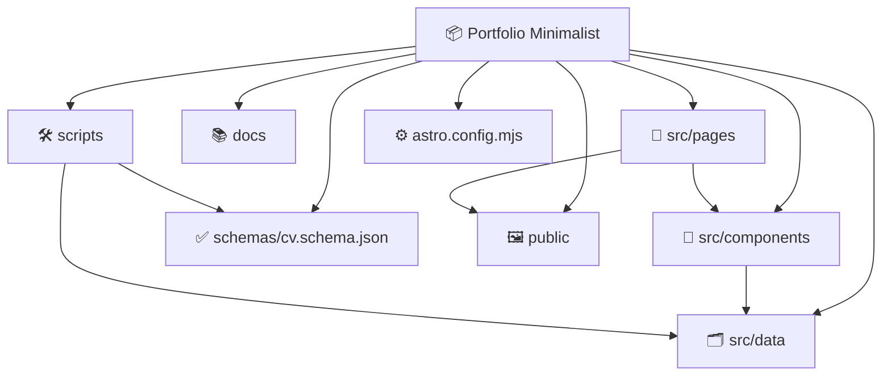

<p align="center">
  
</p>

# Portfolio Minimalist

A printable bilingual portfolio and CV built with Astro, TypeScript, and JSON-based content. The project renders Spanish and English versions from structured CV data and supports both screen and print layouts.

## 🛠️ Tech Stack & Tools

    

------------------------------------------------------------------------

## 📑 Table of Contents

- [Project Overview](#project-overview)
- [Architecture](#architecture)
- [Environment Setup](#environment-setup)
- [Installation](#installation)
  - [Install Dependencies](#install-dependencies)
  - [Configure the Site](#configure-the-site)
  - [Run the Development Server](#run-the-development-server)
- [CV Data](#cv-data)
- [Validation](#validation)
- [Bilingual Content](#bilingual-content)
- [GitHub Pages](#github-pages)
- [Global Commands](#global-commands)

------------------------------------------------------------------------

> [!IMPORTANT]
> ## Project Overview
>
> **Portfolio Minimalist** is a static Astro portfolio and printable CV for a software engineer.
>
> ### Supported Pages
>
> | Page | Data source |
> | --- | --- |
> | Spanish portfolio | `src/pages/index.astro` + `src/data/es.json` |
> | English portfolio | `src/pages/en/index.astro` + `src/data/en.json` |
>
> ### Main Features
>
> - Responsive portfolio layout for desktop and mobile.
> - Printable CV layout with print-specific sections.
> - Spanish and English content managed independently.
> - JSON Schema validation before production builds.
> - Sections for experience, education, courses, diplomas, certificates, skills, languages, hobbies, specializations, and projects.
> - Automatic skill grouping by proficiency level.
> - Fallback icons for skills without a dedicated icon component.

------------------------------------------------------------------------

<h2 id="architecture">🏛️ Architecture</h2>

> [!NOTE]
>
> Content is separated from presentation. CV information lives in JSON files, while Astro components render reusable sections for screen and print layouts.



### Main Directories

| Path | Responsibility |
| --- | --- |
| `src/pages/` | Spanish and English page entry points. |
| `src/components/` | Layout, navigation, keyboard controls, and CV sections. |
| `src/components/sections/` | Individual portfolio and CV sections. |
| `src/data/` | Locale-specific CV JSON files and the disposable example. |
| `src/icons/` | Reusable Astro icons for social networks and technologies. |
| `src/layouts/` | Shared page layout and document structure. |
| `schemas/` | Authoritative JSON Schema for CV data. |
| `scripts/` | Validation scripts. |
| `docs/` | Detailed JSON data documentation. |
| `public/` | Static assets such as the profile image and favicon. |

For the complete data contract, see [docs/SCHEMA_GUIDE.md](docs/SCHEMA_GUIDE.md).

------------------------------------------------------------------------

<h2 id="environment-setup">⚙️ Environment Setup</h2>

### 🧰 Required Tools

| Tool | Purpose |
| --- | --- |
| Node.js | Runs the Astro development server and project scripts. |
| npm | Installs dependencies and runs project commands. |
| Git | Source control and deployment workflow. |
| VS Code | Recommended editor with Astro and TypeScript support. |
| A modern browser | Preview and inspect the portfolio. |

No global Astro installation is required. The project uses the local dependencies installed from `package.json`.

------------------------------------------------------------------------

<h2 id="installation">⚙️ Installation</h2>

> [!IMPORTANT]
>
> Run the commands from the project root.

<h3 id="install-dependencies">1️⃣ Install Dependencies</h3>

```bash
npm install
```

<h3 id="configure-the-site">2️⃣ Configure the Site</h3>

Update [`astro.config.mjs`](astro.config.mjs) with the public site URL and repository base path when deploying to GitHub Pages:

```js
export default defineConfig({
  site: "https://your-username.github.io/your-repository",
  base: "/your-repository/",
});
```

> [!WARNING]
> Keep the `base` value aligned with the repository name. An incorrect base path can break asset and page links after deployment.

<h3 id="run-the-development-server">3️⃣ Run the Development Server</h3>

```bash
npm run dev
```

Open the local URL printed by Astro. The Spanish page is served at `/` and the English page at `/en/`.

------------------------------------------------------------------------

<h2 id="cv-data">🗂️ CV Data</h2>

The editable CV files are:

| File | Language | Use |
| --- | --- | --- |
| [`src/data/es.json`](src/data/es.json) | Spanish | Main Spanish portfolio data. |
| [`src/data/en.json`](src/data/en.json) | English | Main English portfolio data. |
| [`src/data/example.json`](src/data/example.json) | English | Disposable fake data example for reference. |

Do not delete or replace `en.json` or `es.json` when experimenting with the example. The example is independent and can be deleted when it is no longer needed.

The JSON structure supports:

- Personal information and contact profiles.
- Work experience and measurable highlights.
- Education, diplomas, courses, and certificates.
- Professional certificates and specializations.
- Skills with locale-specific levels.
- Languages, hobbies, and projects.
- Optional pricing data.

See [docs/SCHEMA_GUIDE.md](docs/SCHEMA_GUIDE.md) for field descriptions, accepted values, nullable fields, relationships, and examples.

------------------------------------------------------------------------

<h2 id="validation">✅ Validation</h2>

Validate the default locale files:

```bash
npm run validate:cv
```

Validate specific files, including the disposable example:

```bash
npm run validate:cv -- src/data/example.json src/data/en.json src/data/es.json
```

The validator checks JSON syntax, the JSON Schema, URL and email formats, required fields, project-company relationships, and featured-course relationships.

The production build also runs validation automatically:

```bash
npm run build
```

------------------------------------------------------------------------

<h2 id="bilingual-content">🌐 Bilingual Content</h2>

The locale is selected by the page path:

| URL | Locale | Data |
| --- | --- | --- |
| `/` | Spanish | `src/data/es.json` |
| `/en/` | English | `src/data/en.json` |

Keep both locale files structurally aligned. Use the corresponding skill level values:

| Spanish | English |
| --- | --- |
| `Master` | `Master` |
| `Experto` | `Expert` |
| `Avanzado` | `Advanced` |
| `Intermedio` | `Intermediate` |
| `Basico` | `Basic` |

------------------------------------------------------------------------

<h2 id="github-pages">🚀 GitHub Pages</h2>

1. Set `site` and `base` in [`astro.config.mjs`](astro.config.mjs).
2. Confirm both locale pages locally with `npm run dev`.
3. Validate the data with `npm run validate:cv`.
4. Create the production output with `npm run build`.
5. Publish the generated `dist/` directory through the repository's deployment workflow.

------------------------------------------------------------------------

<h2 id="global-commands">🖥️ Global Commands</h2>

| Command | Description |
| --- | --- |
| `npm install` | Installs project dependencies. |
| `npm run dev` | Starts the Astro development server. |
| `npm run start` | Alias for the Astro development server. |
| `npm run validate:cv` | Validates the default or explicitly provided CV JSON files. |
| `npm run build` | Validates the CV data, runs `astro check`, and builds `dist/`. |
| `npm run preview` | Serves the production build locally. |
| `npm run astro` | Runs the local Astro CLI. |

------------------------------------------------------------------------

## 📚 Documentation References

- [CV JSON Schema Guide](docs/SCHEMA_GUIDE.md)
- [CV JSON Schema](schemas/cv.schema.json)
- [Disposable CV Example](src/data/example.json)
- [Astro Configuration](astro.config.mjs)
